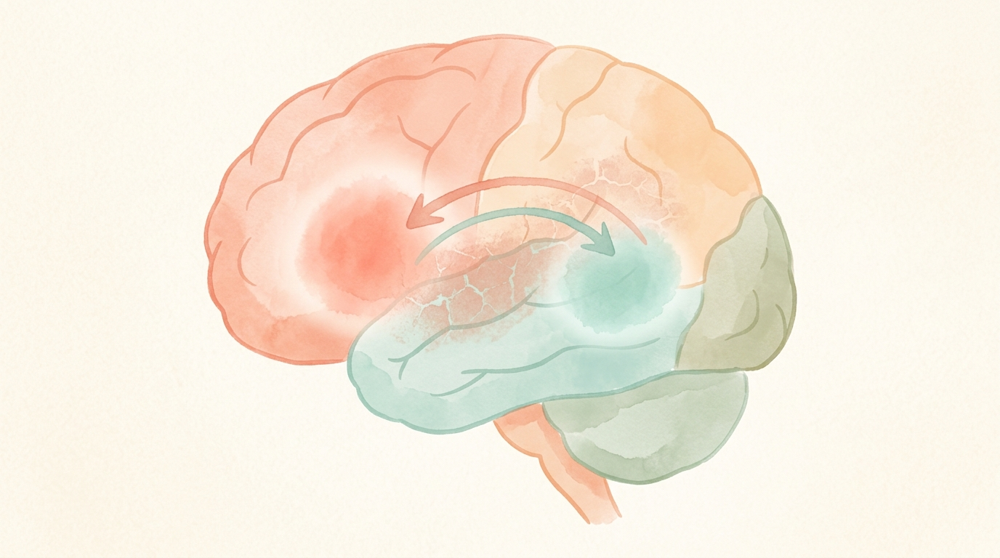

# 中風後的失語症：當腦中的「語言地圖」受了傷

## 一個說不出話的早晨

62 歲的陳先生是一位退休的高中國文老師，平常最愛的事情就是泡一壺茶，跟老朋友在公園下象棋、天南地北聊古詩詞。他的口才向來是朋友圈裡最好的——直到那個星期六的早晨。

那天太太發現他坐在餐桌前，右手拿著湯匙卻怎麼也送不到嘴邊，嘴角還掛著一絲口水。更奇怪的是，當她喊「老陳、老陳你怎麼了？」，他抬起頭，嘴巴張了又張，卻只發得出「啊……那個……那個……」幾個破碎的音。他的眼神很清楚、很焦急，好像明白太太在問什麼，但就是找不到任何一個字可以回答。

太太立刻打 119，救護車送到急診時醫師一聽症狀就警覺：**這是腦中風，而且影響到了語言區。** 電腦斷層與磁振造影確認，是左側大腦中動脈的缺血性腦梗塞，位置正好壓在負責語言的「布洛卡區」上。在 4.5 小時的黃金時間內打了血栓溶解劑之後，陳先生的右半身無力慢慢恢復了一些，但是——他還是說不出完整的句子。

「醫師，我先生是不是變笨了？他都聽得懂，可是講不出話來……」太太紅著眼眶問。

神經科醫師搖搖頭，很慎重地說：「陳太太，他的智力完全沒有退化。他得的叫做**失語症**（Aphasia），是中風打斷了大腦裡控制語言的那條線。但這條線，是有機會修回來的。」

---

## 什麼是失語症？

**失語症（Aphasia）**是一種後天性的**語言障礙**，指的是一個人原本已經學會的聽、說、讀、寫能力，因為大腦**語言區**受損而出現困難。重點在於兩個字：**後天**與**語言**。

- **後天**——不是天生智能不足，也不是從小學不會講話，而是某個時間點之前他的語言能力是正常的，是「失去」了。
- **語言**——問題出在「處理語言」這個認知功能，而不是嘴巴、舌頭、聲帶本身的毛病。病人的智商、記憶、情感通常仍然存在，只是那個「把想法翻譯成詞彙」或「把聽到的聲音解碼成意義」的系統壞掉了。

打個比方：想像大腦裡有一座巨大的**語言圖書館**，架上排著你這輩子學過的每一個字、每一句成語、每一條文法規則。失語症病人不是書被燒光了，而是**圖書館的目錄系統當機**——書都還在，但他找不到它們，或是明明拿到書卻讀不出字。

### 失語症 ≠ 構音障礙

很多家屬會把失語症和**構音障礙（Dysarthria）**搞混。這兩個都是中風後常見的溝通問題，但完全不一樣：

| | 失語症 | 構音障礙 |
|---|---|---|
| 問題出在哪 | 大腦的「語言處理系統」 | 嘴巴、舌頭、嘴唇的肌肉控制 |
| 病人聽得懂嗎 | **不一定**，視類型而定 | 通常聽得懂 |
| 病人腦中有想講的話嗎 | **有，但叫不出來** | 有，而且知道要怎麼講 |
| 講出來的樣子 | 找不到字、用錯字、句子破碎 | 含糊不清、口齒不清，但字用對 |

一個人也可能**同時**有失語症和構音障礙——因為中風常常一次打到好幾個區域。

---

## 有多常見？誰容易發生？

根據國際研究，**大約每 3 位中風存活者就有 1 位會出現失語症**。換句話說，失語症是中風最常見、卻也最被低估的後遺症之一。美國每年新診斷的失語症患者約有 **18 萬人**，總盛行率大約每 272 人就有 1 位。台灣沒有完全對應的全國統計，但若以每年約 3-5 萬人新發中風推估，每年新增的失語症病人至少有 1 萬到 1 萬 5 千人左右。

### 風險因子——其實就是中風的風險因子

因為失語症絕大多數是**中風造成**的（其他原因包括腦外傷、腦瘤、腦炎、失智症等，但比例遠低於中風），所以會增加失語症風險的因素，基本上就是大家熟悉的「中風三高」：

- **高血壓**——最重要的可控制風險因子
- **糖尿病**
- **高血脂 / 膽固醇異常**
- **心房顫動**等心律不整（容易打出血栓塞住腦血管）
- **吸菸**、**過量飲酒**
- **肥胖**、**缺乏運動**
- **年齡**超過 65 歲（但年輕型中風也不算罕見）
- **家族史**與遺傳性血管疾病

為什麼左腦中風特別容易造成失語症？因為約 **95% 的右撇子**和大約 **70% 的左撇子**，語言中樞主要落在**左側大腦**——尤其是左額葉的**布洛卡區（Broca's area）**負責「說出來」，以及左顳葉的**威尼克區（Wernicke's area）**負責「聽懂」。左側大腦中動脈正好灌流這兩個區域，所以一旦這條血管出問題，語言功能幾乎必然遭殃。

---

## 失語症有哪些類型？病人會變成什麼樣子？

臨床上常見的分類方法（波士頓分類系統）會依照三個面向來看：**講得流不流暢、聽不聽得懂、能不能跟著重複別人的話**。以下介紹幾種最常見的類型，用病人會出現的樣子來描述：

### 1. 布洛卡失語症（Broca's aphasia，又稱「表達型」、「非流暢型」）

這就是文章開頭陳先生的狀況。

- **聽得懂**：你問他「今天要不要喝水？」他會點頭。
- **講不出來**：想回答「我想喝一杯熱茶」，但嘴裡只擠得出「茶……熱……喝……」這樣電報式的單字。
- 病人**非常清楚自己講錯了**，常常因此挫折、沮喪、甚至憂鬱。
- 常合併右側肢體無力（因為布洛卡區就在運動區旁邊）。

### 2. 威尼克失語症（Wernicke's aphasia，又稱「接受型」、「流暢型」）

這種反而相反——嘴巴停不下來，但話不通。

- **講得很流利**，語速正常，語調也對，乍聽之下以為在講話。
- 但仔細一聽會發現他在講「**有口無心**」的話：用錯字、自創字、或一堆看似連貫其實沒意義的句子（醫學上叫 word salad，字詞沙拉）。
- **聽不懂別人講什麼**——你問「你餓不餓？」他可能笑笑地回答一段完全不相干的話。
- 因為自己聽不懂，**常常沒有自覺**自己講錯了，家屬會覺得病人「好像變得愛亂講話」。

### 3. 全面性失語症（Global aphasia）

當中風範圍很大、同時打到布洛卡和威尼克兩個區域時，病人會同時失去表達與理解能力，只能發出少數固定的音或單字。這是最嚴重的一型，多半需要靠手勢、圖卡、表情來溝通。

### 4. 命名性失語症（Anomic aphasia）

最輕微、也最常被誤會成「年紀大健忘」的一型。

- 聽得懂、也大致講得出來，但**關鍵名詞常常卡住**。
- 會出現典型的「那個……那個……你知道的啦……就那個……」的講法。
- 看到一支筆，知道它是用來寫字的，但就是想不起來「筆」這個字。

### 5. 傳導性、跨皮質等其他類型

還有幾種比較少見的亞型，差別在於「能不能複誦別人的話」。臨床上現代的作法已經**不再硬把病人塞進某一類**，而是針對每個病人的個別語言剖面去設計治療——因為同一個中風病人也可能表現出多種症狀的混合。

---

## 警訊：什麼時候要立刻叫救護車？

失語症**最常見的起因就是中風**，而中風是**分秒必爭的急症**。一旦家裡有人突然出現以下任何一項，請立刻撥打 **119**，不要等、不要觀察、不要「先睡一下看看」：

**國際通用的 FAST 口訣：**
- **F（Face，臉）**：請他微笑——臉有沒有歪一邊？
- **A（Arm，手）**：請他雙手平舉——有一邊會往下掉嗎？
- **S（Speech，說話）**：請他講一句完整的話——講得清楚嗎？有沒有找不到字、或講不出來？
- **T（Time，時間）**：只要上面任何一項異常，**立刻記下發作時間**，馬上送醫。

**為什麼時間這麼重要？** 因為缺血性腦中風如果能在發作後**4.5 小時內**使用靜脈血栓溶解劑（rt-PA），或在**24 小時內**針對大血管阻塞做動脈取栓，不僅肢體功能可以救回來，**語言功能的恢復也會明顯更好**。每延誤一分鐘，大腦就有將近 **190 萬個神經元**持續死亡——越晚送醫，能救回來的字、能講出來的句子，就越少。

---

## 怎麼診斷失語症？

當中風病人生命穩定之後，醫療團隊會評估語言能力。診斷主要靠以下幾個步驟：

### 1. 神經科醫師的臨床評估
醫師會在床邊做幾項簡單的測試：請病人說出自己的名字、指出圖片中的物品、跟著複誦一句話、聽懂簡單指令（例如「請閉上眼睛」）、讀一段短文、寫下自己的名字。這些就足以大致判斷是哪一類型的失語症。

### 2. 語言治療師的完整評估
語言治療師（Speech-Language Pathologist, SLP）會用標準化的測驗工具做更細緻的分析，常見的工具包括：
- **西方失語症成套測驗（Western Aphasia Battery, WAB）**
- **波士頓失語症診斷測驗（BDAE）**
- **溝通活動日常生活量表（ASHA-FACS）**——用來評估病人在**真實生活情境**中的溝通能力

### 3. 影像學檢查
**腦部電腦斷層（CT）**或**磁振造影（MRI）**能確認中風的位置與範圍，有時會加做**血管攝影（CTA、MRA）**或**灌注影像**來評估血管狀況。

### 4. 排除其他原因
有時候一個看起來像失語症的病人，其實是**聽力問題、譫妄、重度憂鬱、失智症的語言退化**等等。正確診斷決定了後續治療方向。

---

## 治療：語言有機會找回來嗎？

**答案是：絕大多數病人都能恢復一部分，而且越早開始治療越好。**

### 1. 急性期——治療「造成失語症的那個中風」

第一步永遠是處理中風本身：血栓溶解、取栓、控制血壓血糖、預防再中風。**大腦組織救回多少，語言功能就有多少底牌可以打。**

### 2. 語言治療（SLT）——失語症復健的基石

語言治療是目前**證據最強、效果最確定**的治療方式。根據 2025 年發布的**歐洲中風組織（ESO）失語症復健指引**，以及國際上多篇系統性回顧，以下幾點是目前的共識：

- **越早開始越好**——發病後**前 6 個月是黃金期**，大腦的神經可塑性最高。
- **劑量要夠**——指引建議**總時數至少 20 小時以上**，每週頻率高、每次時間長的「密集式治療」效果最好。
- **治療要個人化**——根據病人的語言剖面、興趣、職業、家庭角色去設計。一個退休老師和一個年輕工程師的目標一定不同。
- **家屬要一起學**——家屬是每天 24 小時陪伴病人的「共同治療師」，學會正確的溝通技巧，本身就是治療的一部分。

常見的治療方法包括：
- **旋律語調治療（MIT）**——利用唱歌的韻律幫助布洛卡失語症病人「唱」出句子，因為歌唱功能多由右腦負責，常常還保留著。
- **約束誘發語言治療（CILT）**——限制病人用手勢或筆談，「逼」他練習用講的，類似復健界有名的約束誘發肢體治療。
- **語意特徵分析（SFA）**——針對命名困難，透過描述物品的屬性（顏色、功能、類別）幫助找出詞彙。
- **功能性溝通訓練**——直接練習日常情境：點餐、買東西、打電話、看診。

### 3. 科技輔助

- **電腦 / 平板 App**——讓病人可以在家自行練習，多項隨機對照試驗顯示**遠距與面對面治療效果相當**。
- **擴大及替代溝通（AAC）**——例如溝通板、圖卡、手機 App，不是要「取代」說話，而是在還沒能說出口時，先給病人一條不失去與世界連結的管道。

### 4. 重複性經顱磁刺激（rTMS）——為語言治療「鋪路」的新利器

近十年來，國際上討論最熱、累積證據最多的失語症輔助治療，就是**重複性經顱磁刺激（repetitive Transcranial Magnetic Stimulation, rTMS）**。它的原理其實不難理解：

當左腦的語言區因為中風受傷後，**右腦相對應的區域**會變得過度活躍，試圖「搶著講話」，結果反而干擾了左腦殘存語言區的恢復——就像一支球隊的主將受傷後，替補球員太急著上場，反而打亂了整體節奏。rTMS 的作法，是用頭皮外發出的磁脈衝，**溫和地「壓一壓」右腦那個過度活躍的區域**，讓左腦的語言網絡能重新站回主場，發揮應有的功能。整個過程**不開刀、不打針、不需麻醉**，病人就是戴著一個類似頭盔的裝置坐著，大約 20 分鐘就結束。

國際上多項隨機對照試驗與統合分析的結果相當令人鼓舞：

- **命名能力、流暢度、整體失語商數（AQ）**在多個研究中都出現顯著進步。
- rTMS **搭配語言治療**的效果，明顯優於單獨做語言治療——也就是說，rTMS 是為語言治療「鋪路」的輔助，讓每一次語言治療的成效能被放大。
- **恢復期（發病後 1-6 個月）**接受 rTMS 的病人反應最好，但也有研究顯示**慢性期（一年以上）**停滯的病人仍能從中獲益，這對許多覺得「已經沒救了」的家庭來說非常重要。
- 安全性方面，rTMS 副作用大多輕微且短暫（頭皮刺痛、輕微頭痛），只要由**受過訓練的醫療團隊**依標準參數操作，安全性相當高。

除了 rTMS 之外，另一種非侵入性腦刺激**經顱直流電刺激（tDCS）**也有類似的概念，但目前以 rTMS 的臨床證據較為成熟。**歐洲中風組織 2025 年指引**已經把非侵入性腦刺激列為「可考慮搭配語言治療使用」的輔助選項。

**需要提醒的是**：rTMS 不是魔法，也不是要取代語言治療——它是**強化**語言治療的工具。病人仍然需要搭配規律、密集的語言復健，才能把 rTMS 打開的「神經可塑性窗口」真正轉化成日常溝通能力。台灣目前已有部分神經科、復健科診所與醫院提供 rTMS 治療，有興趣的家屬可以向主治醫師詢問，評估是否適合個別病人的狀況。

### 5. 藥物治療

坦白說，**目前沒有任何一種藥物被證實能明確改善失語症**。過去有研究嘗試使用**失智症藥物（Donepezil）、Piracetam、某些抗憂鬱劑**等，結果好壞參半、證據有限。藥物只能作為語言治療的**輔助**，不能取代。

### 6. 情緒支持

失語症病人合併**憂鬱症**的比例高達 **60% 以上**——想像一下，你腦中有話卻說不出口、親友的關心你聽不懂、或是一開口就被誤會，那種孤獨是外人難以體會的。適時轉介身心科、加入病友團體、家屬衛教，都是治療計畫中不可少的一環。

---

## 家屬能做什麼？九個溝通原則

陳先生這類病人回家後，家屬的角色比任何藥物都重要。台大醫院護理部整理的九項原則，配合國際文獻，可以歸納成以下幾點：

1. **把他當正常的成年人對待**——不要用哄小孩的語氣，也不要在他面前討論他的病情好像他不存在一樣。他的尊嚴還在，智力也還在。
2. **製造安靜的環境**——關掉電視、關掉廣播、一次只跟一個人對話。失語症病人處理語言的認知負荷已經很重，吵雜環境會讓他幾乎無法跟上。
3. **先確認他在注意你**——叫他的名字、看著他的眼睛，再開始講話。
4. **句子要短、要具體**——避免複雜的子句和抽象字眼。「你餓嗎？」好過「你現在會不會想吃點什麼東西？」
5. **放慢速度，但不要拉高音量**——失語症不是耳聾。大聲講話只會讓他更緊張。
6. **給他時間**——找不到字的時候，**請等 10-20 秒**。不要急著幫他講完。你的耐心就是最好的治療。
7. **多元溝通管道**——手勢、圖片、寫字、畫圖、手機照片都可以幫忙。溝通的目的是「傳達」，不是「講漂亮的中文」。
8. **鼓勵、但不要考試**——不要一直問「這個是什麼？那個是什麼？」，那會讓他覺得自己像個失敗的學生。多聊他感興趣的事情就好。
9. **注意自己的表情**——失語症病人對臉部表情和語氣特別敏感。一個微笑、一個點頭，效果遠勝過一大段話。

---

## 預防：怎麼讓失語症不要找上門？

失語症的預防，就是**中風的預防**。這件事情其實沒有捷徑，但每一項都有效：

- **控制好三高**——血壓、血糖、膽固醇。定期量、按時服藥，不要因為「我感覺還好」就自行停藥。
- **戒菸、限酒**——吸菸讓中風風險翻倍，戒菸後風險會逐年下降。
- **規律運動**——每週至少 150 分鐘中等強度有氧運動（快走、游泳、騎腳踏車都可以）。
- **地中海型飲食**——多蔬果、多魚、多堅果、少紅肉、少加工食品。
- **控制體重、保持睡眠品質**。
- **有心房顫動的人**要跟醫師討論是否需要抗凝血藥物。
- **定期健檢**，特別是 50 歲以上、或有家族史的人，做一次頸動脈超音波並不困難。

---

## 回到陳先生的故事

中風後的第三個月，陳先生已經可以慢慢講出幾句簡單的話了。他每週三次到醫院語言治療室，治療師用他最熟悉的**唐詩**當教材——當別的字都叫不出來時，他卻能跟著治療師哼出「床前明月光」的完整一句。那一天陳太太在治療室外偷偷哭了很久。

半年後，他重新回到公園的象棋桌邊。話還是沒辦法像以前那樣流暢，每下一步棋大概只能講出「這個……吃……」這樣簡單的字，但老朋友們都很有耐心地等他。有時候他急得說不出來，就用手指一指棋盤、笑一下，朋友也笑，局就繼續下下去。

一年後的某個下午，他坐在廚房，看著陳太太忙進忙出，突然慢慢地、一字一字地說出了一句完整的話：

「老婆，謝謝你——沒有放棄我。」

---

## 重點整理（5 個 Takeaway）

1. **失語症是語言處理系統壞掉，不是智商退化。** 病人不是變笨了，只是他的話被「鎖」在腦子裡暫時出不來。
2. **發病後前 6 個月是黃金復健期**，越早開始、越密集的語言治療，恢復程度越好。總時數**至少 20 小時**是國際指引的建議門檻。
3. **突然講不出話、聽不懂話，就是中風警訊**——FAST 口訣裡的 S，立刻叫救護車。4.5 小時的血栓溶解時間窗不能等。
4. **家屬的耐心就是最重要的藥物**：安靜環境、短句、放慢、等 10-20 秒、把他當大人對待。
5. **失語症有 60% 以上合併憂鬱**，請不要忽略病人的情緒——他並沒有變得「難相處」，他只是非常非常孤獨。

---

## 何時該就醫？

**立即叫 119（不要等、不要自己開車、不要睡一下看看）：**
- 突然講不出話、或話說得含糊不清
- 突然聽不懂別人的話
- 突然臉歪嘴斜、手腳無力或麻木
- 突然視力模糊、走路不穩、劇烈頭痛

**盡快至神經內科門診：**
- 已經中風康復中，但語言恢復停滯，或懷疑復健強度不夠
- 家屬不知道怎麼跟病人溝通，情緒壓力很大
- 病人出現憂鬱、退縮、拒絕進食或復健

**一般門診就醫：**
- 想評估自己或家人的中風風險
- 想做頸動脈超音波、心電圖或其他預防性檢查

---

## 參考資料

1. Brady MC, Mills C, Øra HP, et al. [European Stroke Organisation (ESO) guideline on aphasia rehabilitation. *European Stroke Journal*, 2025.](https://journals.sagepub.com/doi/10.1177/23969873241311025)
2. Stefaniak JD, Halai AD, Lambon Ralph MA. [The neural and neurocomputational bases of recovery from post-stroke aphasia. *Nature Reviews Neurology*, 2020.](https://pmc.ncbi.nlm.nih.gov/articles/PMC8189855/)
3. Sheppard SM, Sebastian R. [Diagnosing and managing post-stroke aphasia. *Expert Review of Neurotherapeutics*, 2021.](https://pmc.ncbi.nlm.nih.gov/articles/PMC7880889/)
4. Williamson JB, et al. [An updated systematic review of stroke clinical practice guidelines to inform aphasia management.](https://pmc.ncbi.nlm.nih.gov/articles/PMC10614176/)
5. Cleveland Clinic. [Aphasia: Causes, Symptoms & Treatment.](https://my.clevelandclinic.org/health/diseases/5502-aphasia)
6. Mayo Clinic. [Aphasia — Symptoms & causes.](https://www.mayoclinic.org/diseases-conditions/aphasia/symptoms-causes/syc-20369518)
7. Mayo Clinic. [Aphasia — Diagnosis & treatment.](https://www.mayoclinic.org/diseases-conditions/aphasia/diagnosis-treatment/drc-20369523)
8. 徐淑金護理長（臺大醫院護理部）. [與失語症病人的溝通技巧. 臺大醫院健康電子報, 2015 年 3 月.](https://epaper.ntuh.gov.tw/health/201503/health_2.html)
9. 中國醫藥大學附設醫院. [失語症衛教單張.](https://www.cmuh.cmu.edu.tw/HealthEdus/Detail?no=4965)
10. 臺北榮民總醫院復健醫學部. [失語症衛教.](https://wd.vghtpe.gov.tw/pmr/Fpage.action?muid=1214&fid=721)

---

> **免責聲明：** 本文僅供衛教參考，不能取代醫師的專業診斷與治療建議。每位病人的中風位置、範圍、合併症與恢復狀況都不同，治療方案必須由主治醫師與語言治療師依照個別狀況量身規劃。如有疑慮或症狀變化，請立即諮詢您的神經科醫師與語言治療團隊。

*— 小V*
